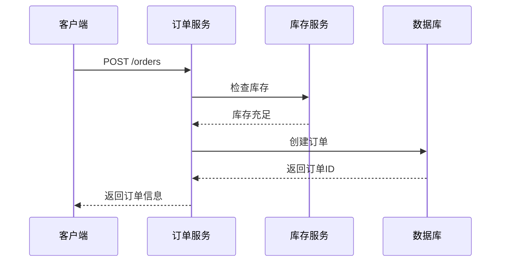
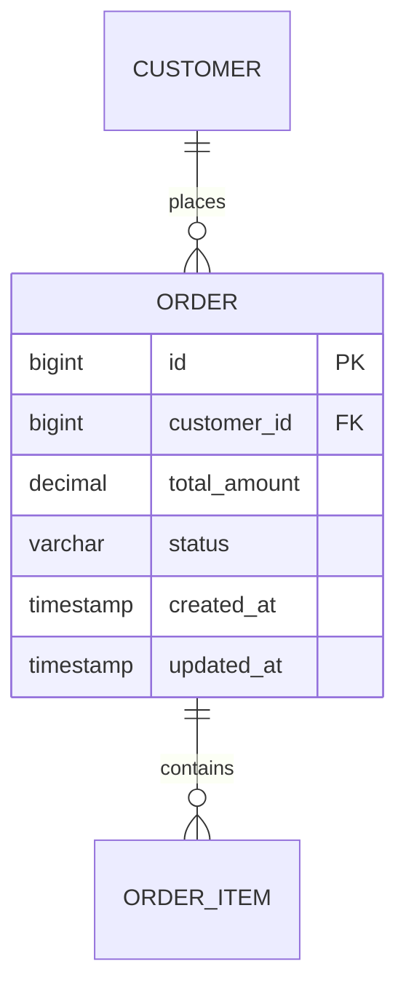
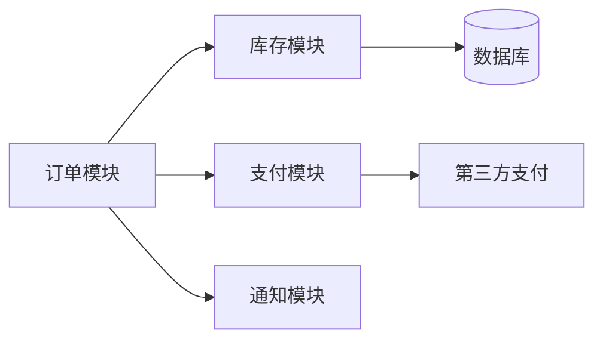

# 页面生成模板

## 系统页面

**路径**: `wiki/systems/{system-name}/{system-name}.md`

**模板**:
```yaml
---
tags: [system, microservice]
date: 2026-04-16
source_count: 1
status: published
type: system
system_type: core | supporting | external
tech_stack: [TypeScript, NestJS, PostgreSQL, Redis]
codebase_path: raw/codebases/order-service
---

# 订单管理系统

## 概述
订单管理系统负责处理用户订单的创建、查询、更新和删除。

## 技术栈
- **语言**: TypeScript 4.8
- **框架**: NestJS 9.0
- **数据库**: PostgreSQL 14.2
- **缓存**: Redis 6.2
- **消息队列**: RabbitMQ 3.9

## 核心模块
- [[order-module]] - 订单核心模块
- [[payment-module]] - 支付处理模块
- [[inventory-module]] - 库存管理模块

## 提供的服务
- [[create-order]] - 创建订单
- [[query-order]] - 查询订单
- [[update-order]] - 更新订单
- [[cancel-order]] - 取消订单

## 架构图
![[order-system-architecture.png]]

## 代码库
- **路径**: raw/codebases/order-service
- **仓库**: https://github.com/company/order-service
- **版本**: 1.0.0

## 相关文档
- [[order-system-design]] - 系统设计文档
```

---

## 组件页面

**路径**: `wiki/components/{system-name}/{module-name}.md`

**模板**:
```yaml
---
tags: [component, module]
date: 2026-04-16
source_count: 1
status: published
type: component
component_type: service | database | api | ui
system: order-service
code_path: src/modules/order
---

# 订单模块

## 概述
订单模块负责订单的核心业务逻辑。

## 所属系统
[[order-service]]

## 职责
- 订单创建
- 订单查询
- 订单更新
- 订单取消

## 提供的服务
- [[create-order]] - 创建订单
- [[query-order]] - 查询订单
- [[update-order]] - 更新订单
- [[cancel-order]] - 取消订单

## 依赖关系
### 依赖的模块
- [[inventory-module]] - 库存检查
- [[payment-module]] - 支付处理

### 被依赖
- [[api-gateway]] - API网关

## 数据模型
- [[order]] - 订单实体
- [[order-item]] - 订单项实体

## 代码位置
- **路径**: src/modules/order
- **Controller**: src/modules/order/order.controller.ts
- **Service**: src/modules/order/order.service.ts
- **Entity**: src/modules/order/entities/order.entity.ts
```

---

## 服务页面

**路径**: `wiki/services/{system-name}/{service-name}.md`

**模板**:
```yaml
---
tags: [service, api]
date: 2026-04-16
source_count: 1
status: published
type: service
system: order-service
module: order-module
---

# 创建订单

## 概述
创建新的订单。

## API 信息
- **方法**: POST
- **路径**: `/orders`
- **认证**: 需要

## 请求参数

```json
{
  "customerId": 123,
  "items": [
    {
      "productId": "prod-001",
      "quantity": 2,
      "price": 99.99
    }
  ]
}
```

### 参数说明

| 参数 | 类型 | 必填 | 说明 |
|-----|------|------|------|
| customerId | number | 是 | 客户ID |
| items | array | 是 | 订单项列表 |
| items[].productId | string | 是 | 产品ID |
| items[].quantity | number | 是 | 数量 |
| items[].price | number | 是 | 单价 |

## 返回值

```json
{
  "id": 1001,
  "customerId": 123,
  "totalAmount": 199.98,
  "status": "pending",
  "createdAt": "2026-04-16T10:00:00Z"
}
```

## 业务流程



## 异常处理

| 错误码 | 说明 |
|-------|------|
| 400 | 参数错误 |
| 401 | 未认证 |
| 409 | 库存不足 |

## 相关页面
- [[order-service]] - 订单服务
- [[order-module]] - 订单模块
- [[order]] - 订单实体

## 代码位置
- **Controller**: src/modules/order/order.controller.ts
- **Service**: src/modules/order/order.service.ts
```

---

## 数据模型页面

**路径**: `wiki/data-models/{system-name}/{entity-name}.md`

**模板**:
```yaml
---
tags: [data-model, entity]
date: 2026-04-16
source_count: 1
status: published
type: data-model
system: order-service
database: postgresql
table_name: orders
---

# Order 实体

## 概述
订单实体，表示用户订单信息。

## 数据库信息
- **表名**: `orders`
- **数据库**: [[postgresql]]
- **所属系统**: [[order-service]]

## 字段定义

| 字段名 | 类型 | 约束 | 说明 |
|-------|------|------|------|
| id | BIGINT | PRIMARY KEY, AUTO_INCREMENT | 主键 |
| customer_id | BIGINT | NOT NULL, FOREIGN KEY | 客户ID |
| total_amount | DECIMAL(10,2) | NOT NULL | 总金额 |
| status | VARCHAR(20) | NOT NULL, DEFAULT 'pending' | 订单状态 |
| created_at | TIMESTAMP | NOT NULL, DEFAULT NOW() | 创建时间 |
| updated_at | TIMESTAMP | | 更新时间 |

## 索引

| 索引名 | 字段 | 类型 | 说明 |
|-------|------|------|------|
| idx_customer_id | customer_id | INDEX | 客户ID索引 |
| idx_created_at | created_at | INDEX | 创建时间索引 |
| idx_status | status | INDEX | 状态索引 |

## 关系

### 关联表
- **OrderItem**: `order_items.order_id` → `orders.id` (一对多)
- **Customer**: `orders.customer_id` → `customers.id` (多对一)

## ER 图



## 业务规则
- 订单状态: pending → paid → shipped → completed
- 取消订单: 只能取消 pending 或 paid 状态的订单
- 总金额: 自动计算订单项金额之和

## 相关代码
- **Entity**: src/modules/order/entities/order.entity.ts
- **Repository**: src/modules/order/repositories/order.repository.ts
- **Service**: src/modules/order/services/order.service.ts
```

---

## 依赖关系页面

**路径**: `wiki/dependencies/{system-name}/dependencies.md`

**模板**:
```yaml
---
tags: [dependency, architecture]
date: 2026-04-16
source_count: 1
status: published
type: dependency
system: order-service
---

# 订单服务依赖关系

## 概述
订单服务的外部和内部依赖关系。

## 外部依赖

### 运行时依赖

| 依赖名称 | 版本 | 类型 | 用途 | Wiki 页面 |
|---------|------|------|------|----------|
| PostgreSQL | 14.2 | 数据库 | 数据存储 | [[postgresql]] |
| Redis | 6.2 | 缓存 | 分布式缓存 | [[redis]] |
| RabbitMQ | 3.9 | 消息队列 | 异步消息 | [[rabbitmq]] |

### 开发依赖

| 依赖名称 | 版本 | 类型 | 用途 |
|---------|------|------|------|
| TypeScript | 4.8 | 语言 | 类型安全 |
| NestJS | 9.0 | 框架 | 应用框架 |
| TypeORM | 0.3 | ORM | 数据访问 |
| Jest | 29.0 | 测试 | 单元测试 |

## 内部依赖



## 依赖关系表

| 模块 | 依赖模块 | 依赖类型 | 说明 |
|-----|---------|---------|------|
| 订单模块 | 库存模块 | 同步调用 | 检查库存 |
| 订单模块 | 支付模块 | 异步消息 | 支付处理 |
| 订单模块 | 通知模块 | 异步消息 | 发送通知 |

## 版本兼容性

| 依赖 | 支持版本 | 当前版本 | 状态 |
|-----|---------|---------|------|
| Node.js | 16.x, 18.x | 18.15.0 | ✅ 兼容 |
| PostgreSQL | 13.x, 14.x | 14.2 | ✅ 兼容 |
| Redis | 6.x | 6.2 | ✅ 兼容 |

## 相关文档
- [[order-service]] - 订单服务
- [[order-system-architecture]] - 系统架构
```
