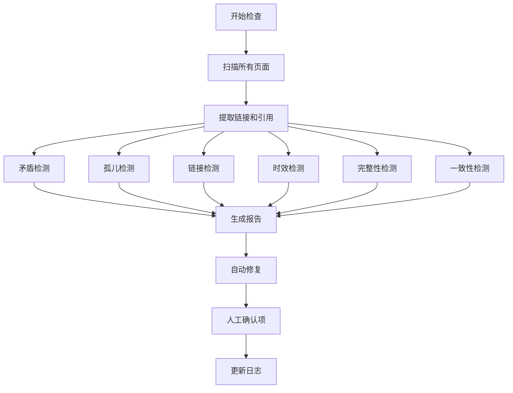

# Lint Wiki

## 目标

健康检查 wiki，发现问题并建议改进，保持 wiki 的质量和一致性。

## 输入

- 可选：检查范围（全部/特定目录）
- 可选：检查类型（矛盾、孤儿、链接等）

## 检查项目

### 1. 矛盾检测

检测页面间的信息矛盾（详见 [contradiction-detection.md](./references/contradiction-detection.md)）：

- **事实矛盾**: 同一事实的不同陈述
- **关系矛盾**: 关系描述的矛盾
- **时间线矛盾**: 时间线的矛盾

### 2. 孤儿页面检测

检测没有入站链接的页面（详见 [orphan-pages.md](./references/orphan-pages.md)）：

- 扫描所有链接
- 统计入站链接数
- 评估页面价值
- 建议添加链接或删除

#### 2.2 入站链接统计

```markdown
## 入站链接统计

| 页面 | 入站链接数 | 状态 |
|-----|-----------|------|
| [[concepts/transformer]] | 15 | ✅ 健康 |
| [[entities/openai]] | 12 | ✅ 健康 |
| [[entities/company-x]] | 0 | ⚠️ 孤儿 |
```

### 3. 缺失链接检测

检测应该存在但缺失的链接（详见 [missing-links.md](./references/missing-links.md)）：

- **提及但未创建**: 频繁提及但没有对应页面的概念
- **失效链接**: 指向不存在页面的链接
- **缺失双向链接**: 应该相互链接但缺失反向链接

### 4. 过时信息检测

检测可能过时的信息：

- **时间标记**: 识别可能过时的陈述
- **来源时效**: 检查来源的时效性

### 5. 数据完整性检查

检测页面的数据完整性：

- **Frontmatter 检查**: 缺失字段、格式问题
- **内容完整性**: 缺少关键部分

### 6. 架构一致性检查

检测架构相关的一致性问题：

- **系统组件一致性**: 页面描述与架构图是否一致
- **依赖关系一致性**: 依赖关系描述是否一致

### 7. 标签一致性

检测标签的使用一致性：

- **标签规范**: 统一标签命名规范
- **标签使用频率**: 分析标签使用情况

## 输出格式

### 摘要报告

```markdown
# Wiki 健康检查报告

**检查时间**: 2026-04-16
**检查范围**: 全部

## 摘要

| 检查项 | 发现问题 | 严重程度 |
|-------|---------|---------|
| 矛盾检测 | 3 | 🔴 高 |
| 孤儿页面 | 5 | 🟡 中 |
| 缺失链接 | 8 | 🟡 中 |
| 过时信息 | 2 | 🟡 中 |
| 数据完整性 | 4 | 🟢 低 |
| 架构一致性 | 1 | 🟡 中 |
| 标签一致性 | 6 | 🟢 低 |

**总体健康度**: 75/100

## 优先修复项

1. 🔴 **矛盾**: [[entities/openai]] - GPT-4 发布日期矛盾
2. 🔴 **矛盾**: [[systems/order-service]] - 调用方式矛盾
3. 🔴 **矛盾**: [[concepts/transformer]] - 发布时间矛盾

## 建议操作

### 立即修复
- 解决 3 个矛盾问题
- 为 5 个孤儿页面添加链接

### 近期改进
- 创建 8 个缺失的页面
- 更新 2 个过时的信息

### 长期优化
- 统一标签命名
- 补充不完整的页面内容
```

## 自动修复

支持自动修复以下问题：

- **Frontmatter 格式**: 修复日期格式、标签格式
- **标签统一**: 统一标签大小写
- **简单链接**: 添加明显的缺失链接

## 示例

详细的检查示例请参考 [examples.md](./references/examples.md)，包括：
- 完整检查示例
- 部分检查示例
- 特定类型检查示例
- 自动修复示例

## 注意事项

1. **定期检查**: 建议每周运行一次完整检查
2. **优先级处理**: 先处理高优先级问题
3. **人工审核**: 自动修复后建议人工审核
4. **保存报告**: 将报告保存到 `wiki/analyses/` 目录

为每个检查项生成详细报告：

```markdown
## 详细报告

### 1. 矛盾检测

#### 1.1 事实矛盾

**实体**: [[entities/openai]]

**矛盾描述**:
- 陈述1: "GPT-4 发布于 2023 年 3 月"
  - 来源: [[sources/article-1]]
  - 日期: 2023-03-15
- 陈述2: "GPT-4 发布于 2023 年 6 月"
  - 来源: [[sources/article-2]]
  - 日期: 2023-06-20

**建议操作**:
1. 核实准确日期（推荐查看官方公告）
2. 更新 [[entities/openai]] 页面
3. 在 [[sources/article-2]] 中添加勘误说明

**修复命令**:
```
更新 [[entities/openai]] 页面，将 GPT-4 发布日期修正为 2023 年 3 月
```
```

## 自动修复

对于某些问题，可以自动修复：

### 自动修复项

1. **Frontmatter 格式**: 自动修正格式问题
2. **标签统一**: 自动统一标签命名
3. **双向链接**: 自动添加缺失的反向链接

### 需人工确认

1. **矛盾解决**: 需要人工判断正确信息
2. **页面创建**: 需要人工补充内容
3. **过时信息**: 需要人工核实更新

## 执行流程



## 记录日志

在 `wiki/log.md` 中记录：

```markdown
## [2026-04-16] lint | Wiki 健康检查
- 检查范围: 全部
- 发现问题: 29 个
- 自动修复: 10 个
- 需人工处理: 19 个
- 健康度: 75/100
- 详细报告: wiki/analyses/lint-report-2026-04-16.md
```

## 示例

### 完整检查

```
用户: /lint-wiki

助手:
# Wiki 健康检查报告

**检查时间**: 2026-04-16
**检查范围**: 全部

## 摘要

| 检查项 | 发现问题 | 严重程度 |
|-------|---------|---------|
| 矛盾检测 | 3 | 🔴 高 |
| 孤儿页面 | 5 | 🟡 中 |
| 缺失链接 | 8 | 🟡 中 |
| 过时信息 | 2 | 🟡 中 |
| 数据完整性 | 4 | 🟢 低 |

**总体健康度**: 75/100

## 🔴 高优先级问题

### 矛盾: GPT-4 发布日期
- 页面: [[entities/openai]]
- 详情: 两个来源给出不同日期
- 建议: 核实官方信息并更新

## 🟡 中优先级问题

### 孤儿页面 (5个)
- [[entities/company-x]]
- [[entities/person-y]]
- ...

### 缺失页面 (8个)
- "注意力机制" - 在 5 个页面中提及
- ...

## 自动修复

✅ 已自动修复 10 个问题:
- Frontmatter 格式: 4 个
- 标签统一: 6 个

## 需要人工处理

请处理以下 19 个问题:
1. 解决 3 个矛盾
2. 为 5 个孤儿页面添加链接
3. 创建 8 个缺失页面
4. 更新 2 个过时信息

详细报告已保存: wiki/analyses/lint-report-2026-04-16.md
```

### 部分检查

```
用户: /lint-wiki wiki/systems/

助手:
# Wiki 健康检查报告

**检查时间**: 2026-04-16
**检查范围**: wiki/systems/

## 摘要

| 检查项 | 发现问题 |
|-------|---------|
| 架构一致性 | 1 |
| 缺失链接 | 2 |
| 数据完整性 | 1 |

**健康度**: 90/100

## 发现的问题

### 架构不一致
- [[systems/order-service]] 与架构图组件列表不一致

### 缺失链接
- [[systems/order-service]] 缺少对 [[services/create-order]] 的链接
- [[systems/inventory-service]] 缺少对 [[data-models/inventory]] 的链接

### 内容不完整
- [[systems/payment-service]] 缺少"技术栈"信息
```

## 注意事项

1. **定期执行**: 建议每周或每次大量更新后执行
2. **优先级处理**: 先处理高优先级问题
3. **人工审核**: 自动修复后需人工审核
4. **保存报告**: 保存详细报告供后续参考
5. **持续改进**: 根据检查结果优化 wiki 结构
