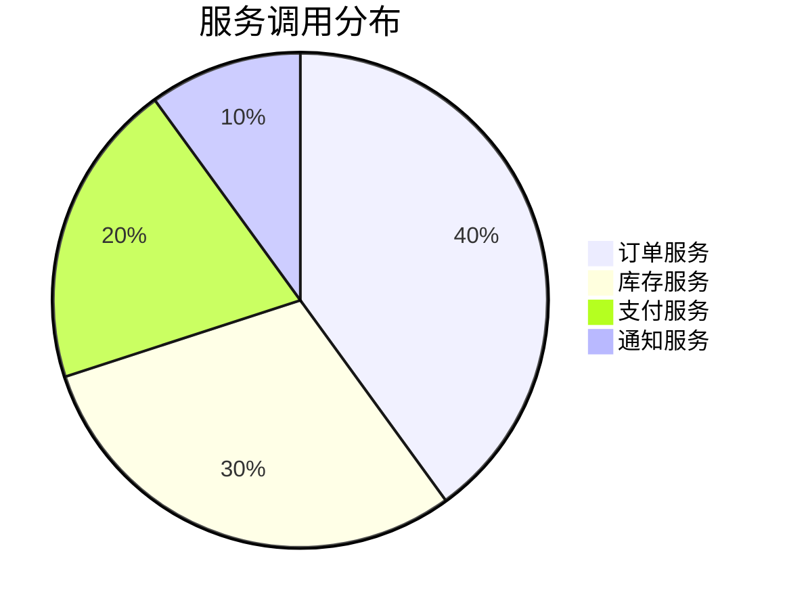

# Query Wiki

## 目标

查询 wiki 内容，综合答案并添加引用，支持将答案保存为新的 wiki 页面。

## 输入

- 查询问题（自然语言）
- 可选：输出格式（markdown、表格、图表等）
- 可选：是否保存答案为 wiki 页面

## 处理流程

### 1. 分析查询意图

识别查询类型（详见 [query-types.md](./references/query-types.md)）：

- **事实查询**: "什么是 Transformer？"
- **关系查询**: "订单服务和库存服务的关系是什么？"
- **对比查询**: "比较 GPT-4 和 Claude 3 的差异"
- **列表查询**: "订单系统包含哪些组件？"
- **流程查询**: "下单的完整流程是什么？"
- **架构查询**: "展示订单系统的架构"
- **分析查询**: "分析微服务架构的优缺点"

### 2. 搜索相关页面

#### 2.1 读取索引

```
读取 wiki/index.md
识别相关的页面类别
```

#### 2.2 关键词匹配

从查询中提取关键词：

- 实体名称
- 概念名称
- 系统名称
- 组件名称
- 服务名称

#### 2.3 定位相关页面

根据关键词在索引中查找：

```markdown
## 相关页面

### 实体
- [[entities/openai]] - OpenAI 组织
- [[entities/anthropic]] - Anthropic 组织

### 概念
- [[concepts/transformer]] - Transformer 架构
- [[concepts/attention-mechanism]] - 注意力机制

### 系统
- [[systems/order-service]] - 订单服务系统
```

### 3. 读取页面内容

读取所有相关页面的完整内容：

```
读取 wiki/entities/openai.md
读取 wiki/concepts/transformer.md
读取 wiki/systems/order-service/order-service.md
...
```

### 4. 综合答案

#### 4.1 整合信息

- 从多个页面提取相关信息
- 识别信息的时间线
- 检测信息间的矛盾
- 建立信息间的关联

#### 4.2 添加引用

为每个事实添加引用：

```markdown
OpenAI 是一家人工智能研究组织[[entities/openai]]。

GPT-4 是 OpenAI 发布的大语言模型，于2023年发布[[sources/openai-gpt4-paper]]。

Transformer 架构是现代大语言模型的基础[[concepts/transformer]]。
```

#### 4.3 标注置信度

对不确定的信息标注置信度：

```markdown
据推测，GPT-4 的参数量约为 1.8 万亿（置信度：中等）[[sources/gpt4-analysis]]。
```

### 5. 生成输出

根据查询类型和用户偏好生成不同格式的输出（详见 [output-formats.md](./references/output-formats.md)）：

- **Markdown 页面**: 事实查询、分析查询
- **对比表格**: 对比查询
- **流程图**: 流程查询
- **架构图**: 架构查询
- **时序图**: 关系查询

### 6. 保存答案（可选）

如果用户选择保存答案，或答案具有长期价值：

#### 6.1 确定页面类型

- 对比查询 → `wiki/analyses/comparison-{name}.md`
- 流程查询 → `wiki/analyses/flow-{name}.md`
- 架构查询 → `wiki/architectures/diagrams/{name}.md`
- 分析查询 → `wiki/analyses/analysis-{name}.md`

#### 6.2 创建页面

使用相应模板创建页面：

```yaml
---
tags: [analysis, comparison, ...]
date: 2026-04-16
source_count: 5
status: published
type: comparison | analysis | ...
query: 原始查询
---

# {标题}

{答案内容}
```

#### 6.3 更新索引

在 `wiki/index.md` 中添加新页面条目。

#### 6.4 记录日志

在 `wiki/log.md` 中记录：

```markdown
## [2026-04-16] query | {查询摘要}
- 查询: {原始查询}
- 生成页面: wiki/analyses/{name}.md
- 引用页面: 5个
```

## 输出

向用户展示答案：

```
📝 查询结果

{答案内容}

📊 统计:
- 查询页面: X 个
- 引用来源: Y 个

💾 保存选项:
是否将此答案保存为 wiki 页面？
- 保存为: wiki/analyses/{name}.md
- 输入 "save" 确认保存
```

## 查询示例

详细的查询示例请参考 [examples.md](./references/examples.md)，包括：
- 事实查询示例
- 关系查询示例
- 对比查询示例
- 架构查询示例
- 流程查询示例

## 注意事项

1. **优先使用索引**: 先读索引再读具体页面，提高效率
2. **添加引用**: 每个事实都应有引用
3. **标注置信度**: 不确定的信息要明确标注
4. **检测矛盾**: 如果信息矛盾，明确指出
5. **保存有价值的答案**: 避免重复查询

## 高级功能

### 多轮查询

支持多轮对话式查询：

```
用户: 订单系统有哪些服务？
助手: {列出服务}

用户: 订单服务具体做什么？
助手: {基于上下文理解，详细说明订单服务}
```

### 查询建议

基于 wiki 内容主动建议查询：

```
💡 您可能还想了解:
- 订单服务的详细架构
- 支付流程的完整说明
- 库存管理的实现细节
```

### 数据可视化

对于数据密集型查询，生成图表：

```markdown
## 服务调用统计


```
