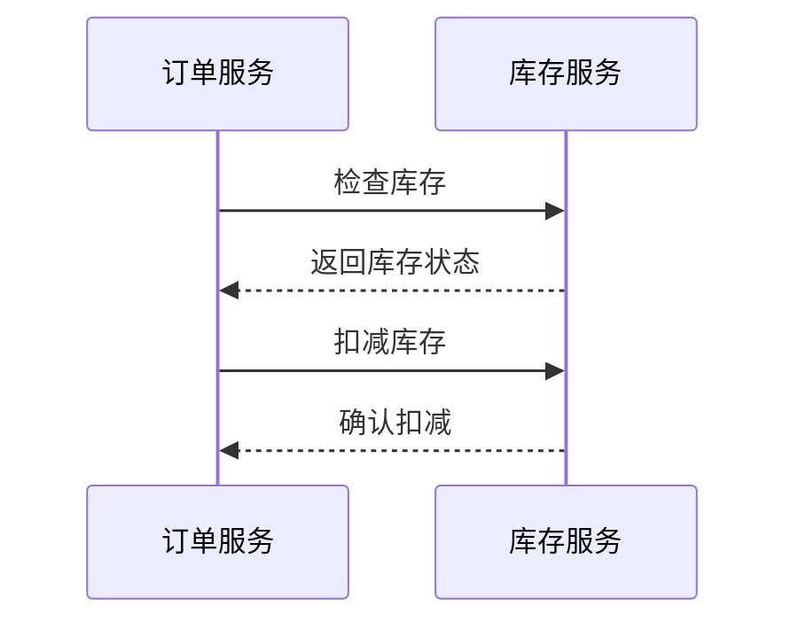
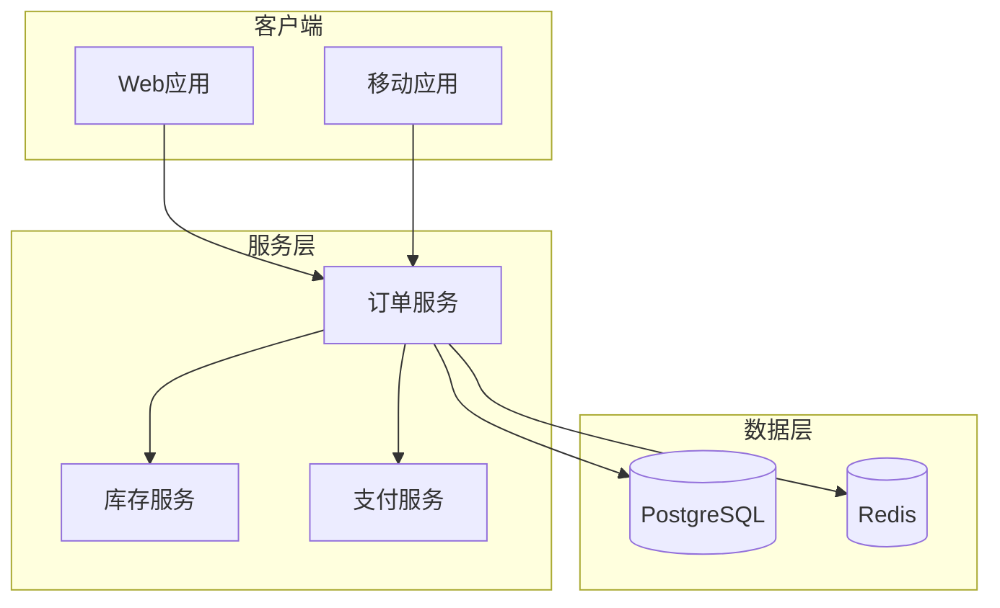
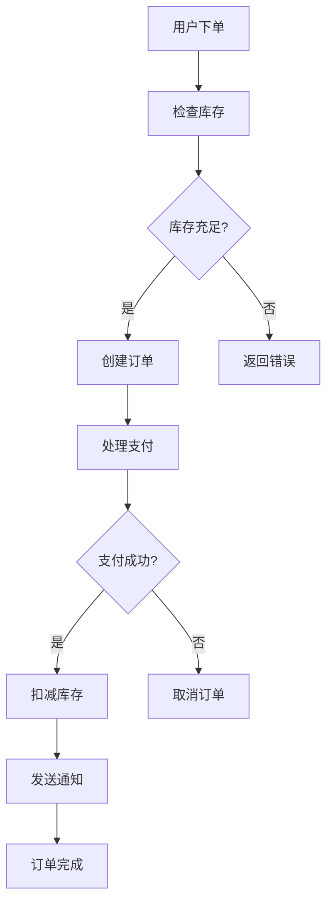

# 查询示例

## 示例 1: 事实查询

**用户输入**:
```
/query-wiki 什么是 Transformer？
```

**助手输出**:
```
📝 查询结果: Transformer

## 概述
Transformer 是一种基于自注意力机制的神经网络架构，由 Google 于 2017 年提出[[sources/attention-is-all-you-need]]。

## 核心特性
- **自注意力机制**: 允许模型在处理序列时关注任意位置[[concepts/attention-mechanism]]
- **并行化**: 相比 RNN，可以并行处理序列
- **位置编码**: 通过位置编码保留序列顺序信息

## 应用
- 大语言模型（GPT、BERT、Claude 等）[[entities/openai]][[entities/anthropic]]
- 机器翻译
- 文本摘要

📊 统计:
- 查询页面: 3 个
- 引用来源: 2 个
```

---

## 示例 2: 关系查询

**用户输入**:
```
/query-wiki 订单服务和库存服务的关系是什么？
```

**助手输出**:
```
📝 查询结果: 订单服务与库存服务关系

## 关系概述
订单服务在下单时调用库存服务检查和扣减库存[[systems/order-service]][[systems/inventory-service]]。

## 交互流程



## 详细说明
1. **库存检查**: 订单服务创建订单前，先调用库存服务检查库存[[services/create-order]]
2. **库存扣减**: 支付成功后，订单服务调用库存服务扣减库存[[services/process-payment]]
3. **库存回滚**: 如果订单取消，库存服务回滚库存[[services/cancel-order]]

## 相关页面
- [[systems/order-service]] - 订单服务详情
- [[systems/inventory-service]] - 库存服务详情
- [[architectures/diagrams/order-flow]] - 订单流程图

📊 统计:
- 查询页面: 5 个
- 引用来源: 3 个
```

---

## 示例 3: 对比查询

**用户输入**:
```
/query-wiki 比较 GPT-4 和 Claude 3
```

**助手输出**:
```
📝 查询结果: GPT-4 vs Claude 3

| 维度 | GPT-4 | Claude 3 |
|-----|-------|----------|
| 开发者 | OpenAI[[entities/openai]] | Anthropic[[entities/anthropic]] |
| 发布时间 | 2023-03 | 2024-03 |
| 上下文长度 | 8K/32K | 200K |
| 多模态 | 支持 | 支持 |
| 参数量 | 未公开 | 未公开 |
| 定价 | $0.03/1K tokens | $0.015/1K tokens |

## 主要差异

### 上下文长度
Claude 3 的上下文长度（200K）远超 GPT-4（32K），适合处理长文档[[sources/claude3-announcement]]。

### 安全性
Claude 3 强调 Constitutional AI，注重安全性和可控性[[concepts/constitutional-ai]]。

### 定价
Claude 3 的定价约为 GPT-4 的一半[[sources/pricing-comparison]]。

📊 统计:
- 查询页面: 6 个
- 引用来源: 4 个

💾 是否保存为对比分析页面？
```

---

## 示例 4: 架构查询

**用户输入**:
```
/query-wiki 展示订单系统的架构
```

**助手输出**:
```
📝 查询结果: 订单系统架构

## 系统架构图



## 核心组件

### 订单服务
- 职责: 订单创建、查询、更新、取消
- 技术栈: Spring Boot, PostgreSQL
- 详情: [[systems/order-service]]

### 库存服务
- 职责: 库存检查、扣减、回滚
- 技术栈: Spring Boot, Redis
- 详情: [[systems/inventory-service]]

### 支付服务
- 职责: 支付处理、退款
- 技术栈: Spring Boot
- 详情: [[systems/payment-service]]

## 数据流
1. 用户下单 → 订单服务
2. 订单服务 → 库存服务（检查库存）
3. 订单服务 → 支付服务（处理支付）
4. 支付成功 → 订单服务（更新状态）

📊 统计:
- 查询页面: 8 个
- 引用来源: 3 个
```

---

## 示例 5: 流程查询

**用户输入**:
```
/query-wiki 下单的完整流程是什么？
```

**助手输出**:
```
📝 查询结果: 下单流程

## 流程图



## 详细说明

### 1. 用户下单
- **描述**: 用户提交订单信息
- **执行者**: 订单服务
- **相关页面**: [[services/create-order]]

### 2. 检查库存
- **描述**: 检查商品库存是否充足
- **执行者**: 库存服务
- **相关页面**: [[services/check-inventory]]

### 3. 创建订单
- **描述**: 创建订单记录，状态为 pending
- **执行者**: 订单服务
- **相关页面**: [[services/create-order]]

### 4. 处理支付
- **描述**: 调用支付服务处理支付
- **执行者**: 支付服务
- **相关页面**: [[services/process-payment]]

### 5. 扣减库存
- **描述**: 支付成功后扣减库存
- **执行者**: 库存服务
- **相关页面**: [[services/deduct-inventory]]

### 6. 发送通知
- **描述**: 发送订单确认通知
- **执行者**: 通知服务
- **相关页面**: [[services/send-notification]]

📊 统计:
- 查询页面: 6 个
- 引用来源: 4 个
```
