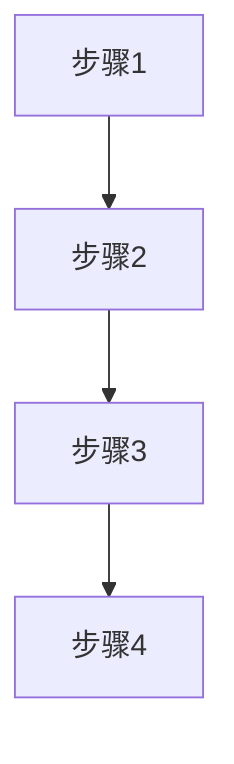
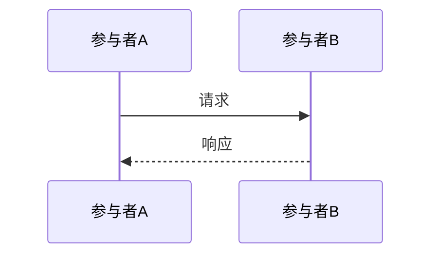
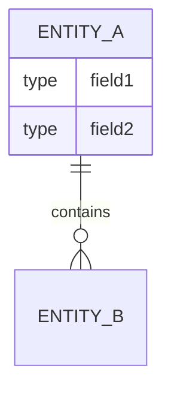

# 输出格式说明

## Markdown 页面

**适用场景**: 事实查询、分析查询

**模板**:
```markdown
# {查询问题}

## 概述
{答案概述}

## 详细说明
{详细答案}

## 相关页面
- [[page-1]]
- [[page-2]]

## 引用
- [[source-1]] - 来源1
- [[source-2]] - 来源2
```

---

## 对比表格

**适用场景**: 对比查询

**模板**:
```markdown
# {实体A} vs {实体B}

| 维度 | {实体A} | {实体B} |
|-----|---------|---------|
| 属性1 | 值1 | 值2 |
| 属性2 | 值3 | 值4 |
| 来源 | [[source-1]] | [[source-2]] |

## 主要差异

### {维度1}
{差异说明}

### {维度2}
{差异说明}
```

---

## 流程图

**适用场景**: 流程查询

**模板**:
```markdown
# {流程名称}

## 流程图



## 详细说明

### 步骤1
- **描述**: {说明}
- **执行者**: {组件/服务}
- **相关页面**: [[component-1]]

### 步骤2
- **描述**: {说明}
- **执行者**: {组件/服务}
- **相关页面**: [[component-2]]
```

---

## 架构图

**适用场景**: 架构查询

**模板**:
```markdown
# {系统名称} 架构

## 架构图

```mermaid
graph TB
    subgraph {层级1}
        A[组件A]
        B[组件B]
    end
    
    subgraph {层级2}
        C[组件C]
    end
    
    A --> B
    B --> C
```

## 核心组件

### 组件A
- **职责**: {说明}
- **技术栈**: {技术}
- **详情**: [[component-a]]

### 组件B
- **职责**: {说明}
- **技术栈**: {技术}
- **详情**: [[component-b]]

## 数据流
1. {数据流说明1}
2. {数据流说明2}
```

---

## 时序图

**适用场景**: 关系查询、交互流程

**模板**:
```markdown
# {交互名称}

## 时序图



## 详细说明
1. **步骤1**: {说明} [[component-1]]
2. **步骤2**: {说明} [[component-2]]
```

---

## ER 图

**适用场景**: 数据模型查询

**模板**:
```markdown
# {数据模型名称}

## ER 图



## 实体说明

### ENTITY_A
- **表名**: {表名}
- **字段**: {字段列表}
- **详情**: [[entity-a]]
```

---

## 饼图

**适用场景**: 统计查询、分布查询

**模板**:
```markdown
## {统计标题}


## 说明
- {类别1}: {说明}
- {类别2}: {说明}
```
