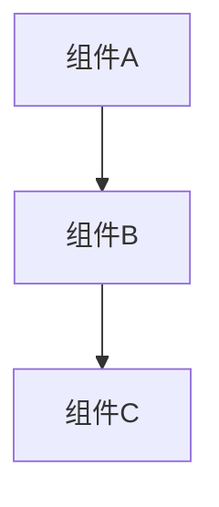

# {Diagram Name}

## 概述
<!-- 图表目的、范围、受众 -->

## 架构图

### Mermaid 格式



### PlantUML 格式（ArchiMate）

```plantuml
@startuml
!include ArchiMate.puml

Business_Process(BP1, "业务流程")
Application_Service(AS1, "应用服务")

Triggering_Rel(BP1, AS1, "")
@enduml
```

## 图例说明
- **实线箭头**: 直接调用关系
- **虚线箭头**: 依赖关系

## 元素详情

### 业务层
- **业务流程A**: [[business-process-a]] - 描述

### 应用层
- **应用服务B**: [[app-service-b]] - 描述

## 关系说明

| 源 | 关系类型 | 目标 | 说明 |
|---|---------|------|------|
| 组件A | 调用 | 组件B | 说明 |

## 相关文档
- [[source-document]] - 来源文档
