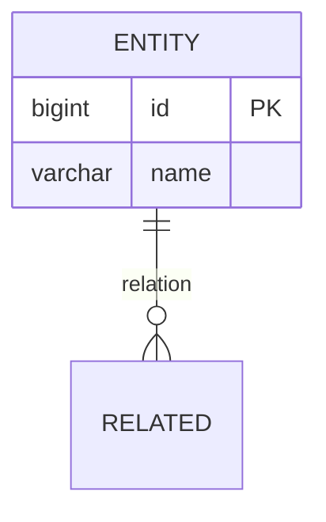

# {Entity Name}

## 概述
<!-- 实体描述、业务含义 -->

## 数据库信息
- **表名**: `table_name`
- **数据库**: [[database-name]]
- **所属系统**: [[system-name]]

## 字段定义

| 字段名 | 类型 | 约束 | 说明 |
|-------|------|------|------|
| id | BIGINT | PRIMARY KEY | 主键 |

## 索引

| 索引名 | 字段 | 类型 | 说明 |
|-------|------|------|------|
| idx_name | field | INDEX | 索引说明 |

## 关系

### 关联表
- **TableA**: `table_a.id` → `table_b.id` (关系类型)

## ER 图

## 业务规则
- 规则1
- 规则2

## 相关代码
- **Entity**: 
- **Repository**: 
