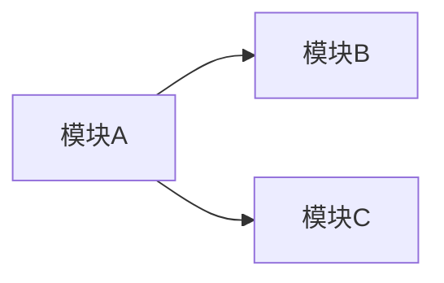

# {System Name} 依赖关系

## 概述
<!-- 依赖关系说明 -->

## 外部依赖

### 运行时依赖

| 依赖名称 | 版本 | 类型 | 用途 | Wiki 页面 |
|---------|------|------|------|----------|
| PostgreSQL | 14.2 | 数据库 | 数据存储 | [[postgresql]] |

### 开发依赖

| 依赖名称 | 版本 | 类型 | 用途 |
|---------|------|------|------|
| TypeScript | 4.8 | 语言 | 类型安全 |

## 内部依赖

## 依赖关系表

| 模块 | 依赖模块 | 依赖类型 | 说明 |
|-----|---------|---------|------|
| 模块A | 模块B | 同步调用 | 说明 |

## 版本兼容性

| 依赖 | 支持版本 | 当前版本 | 状态 |
|-----|---------|---------|------|
| Node.js | 16.x, 18.x | 18.15.0 | ✅ 兼容 |

## 相关文档
- [[system-name]] - 系统详情
