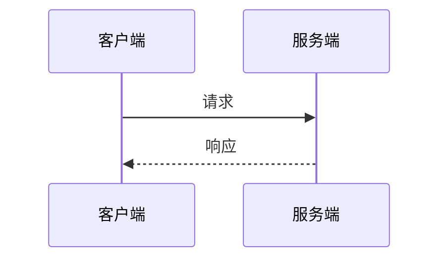

# {Service Name}

## 概述
<!-- 服务简介、功能说明 -->

## API 信息
- **方法**: GET | POST | PUT | DELETE
- **路径**: /api/xxx
- **认证**: 需要 | 不需要

## 请求参数

```json
{
  "param1": "value1",
  "param2": "value2"
}
```

### 参数说明

| 参数 | 类型 | 必填 | 说明 |
|-----|------|------|------|
| param1 | string | 是 | 参数说明 |

## 返回值

```json
{
  "result": "success"
}
```

## 业务流程



## 异常处理

| 错误码 | 说明 |
|-------|------|
| 400 | 参数错误 |
| 401 | 未认证 |

## 相关页面
- [[system-name]] - 所属系统
- [[module-name]] - 所属模块

## 代码位置
- **Controller**: 
- **Service**: 
